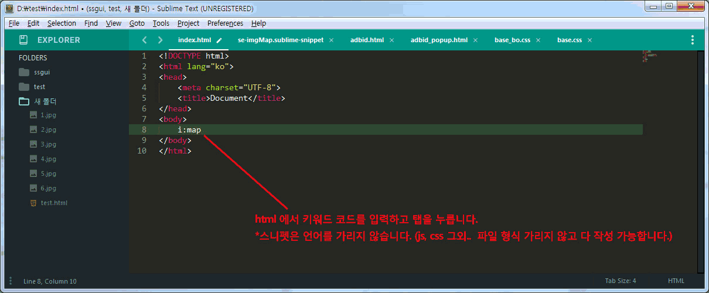
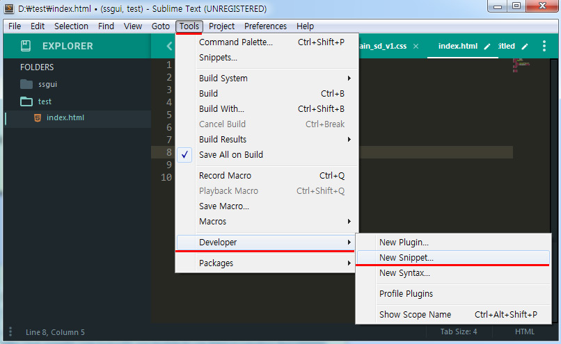
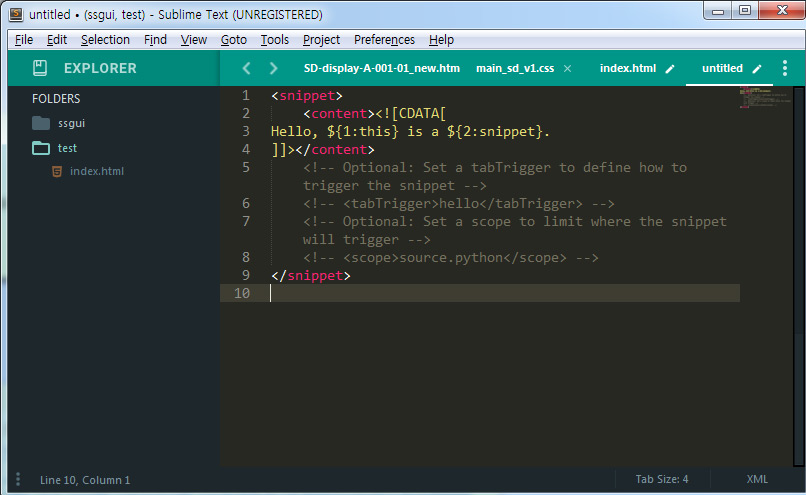
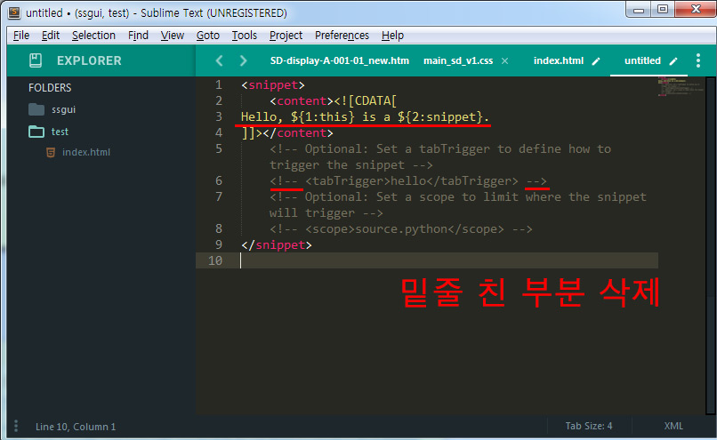
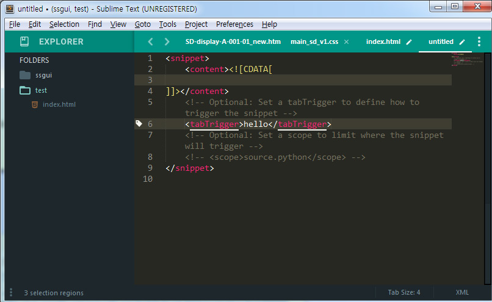
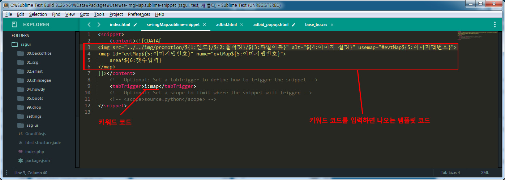
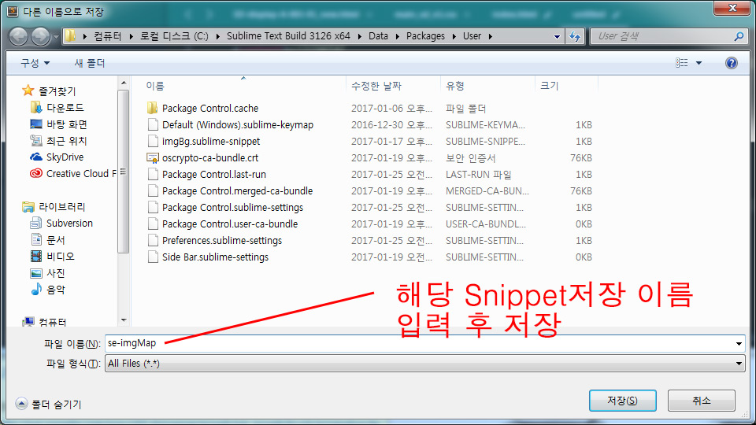

## Snippet 사용하기
** 스니펫은 Emmet같은 기능으로 트리거 코드를 입력하면 다음과 같이 코드를 자동완성 시켜줍니다. **
** 스니펫은 원하는 코드를 빠르게 자동완성 시켜줍니다. **

** 스니펫 파일은 공유가 가능합니다. **

** 1. 상단 메뉴의 Tools -> Developer -> New Snippet... 선택 **

** 2. 위와 같이 입력했다면 다음과 같이 열립니다. **

** 3. 수정해야할 부분을 확인 **

** 4. 밑줄 친 부분을 삭제 **

** 5. 다음 사진과 같이 3번 라인부터는 원하는 코드를 입력하고 'tabTrigger'사이에는 3번라인부터 입력한 코드를 불러올 키워드를 입력합니다. **

** 6. 컨트롤 + S 키로 저장을 하면 뜨는 창에서 경로이동을 하지 않고 파일 이름을 알아보기 쉽고 의미에 맞게 입력합니다. **

** 7. HTML로 돌아가 작성했던 코드를 테스트 합니다. **
